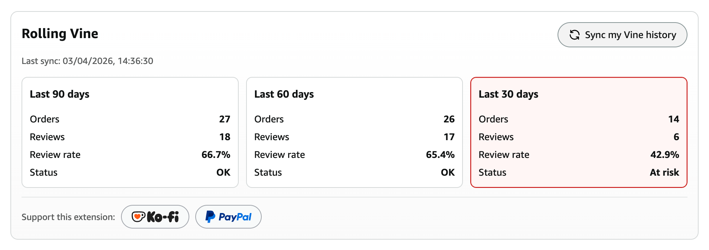

<p align="center">
	
</p>

Rolling Vine is a cross-browser WebExtension (Chrome + Firefox) for Amazon Vine users.
It adds rolling periods statistics to the Vine Account page and highlights risk windows where review completion rate is below 60%.

[](https://ko-fi.com/fedefluork)
[](https://paypal.me/FedeFluork)

## What It Does

On the Vine Account page (`/vine/account`), the extension injects:

- 3 rolling periods cards: Last 90 days, Last 60 days, Last 30 days
- For each card:
	- Orders
	- Reviews
	- Review rate
	- Status (`At risk` when rate is below 60%, otherwise `OK`)
- Sync controls:
	- `Sync my Vine history` button
	- `Last sync: <timestamp>` label
- A compact donation row with links to Ko-fi and PayPal

<p align="center">
	
</p>

## How Sync Works

Sync is user-triggered from your Vine Account page at `/vine/account`.

1. User clicks `Sync my Vine history`.
2. Service worker opens a non-active background tab.
3. Worker scans pages in this strict order:
	 - Orders:
		 - `/vine/orders`
		 - `/vine/orders?page=2`
		 - `/vine/orders?page=3`
		 - ...
	 - Completed reviews:
		 - `/vine/vine-reviews?review-type=completed`
		 - `/vine/vine-reviews?page=2&review-type=completed`
		 - `/vine/vine-reviews?page=3&review-type=completed`
		 - ...
4. It counts only items in the last 90 days from sync start.
5. It stops section scan when the parser detects older-than-90-day items.
6. It stores 90/60/30-day aggregates locally and updates Account cards.

## Safety and Failure Policy

The sync pipeline stops safely and immediately if it detects:

- CAPTCHA pages
- Login/session expiration
- Empty or unexpected markup (no parsable records)
- Navigation timeout

When safe-stop happens, previous valid metrics remain visible and the sync status reports the reason.

The worker uses small bounded random delays between page transitions for load pacing and stability.

## Data Model and Risk Logic

For each period (`90`, `60`, `30`):

- `review_rate = (reviews / orders) * 100`
- If `review_rate < 60`, status is `At risk`
- If `review_rate >= 60`, status is `OK`
- If `orders == 0`, review rate is shown as `N/A`, status remains neutral (`OK`)

## Browser Compatibility Choices

- Single codebase with Manifest V3
- Firefox compatibility via `browser_specific_settings.gecko` in manifest
- Cross-browser compatible `chrome.*` extension APIs and Promise wrappers in shared storage helpers
- Browser-specific behavior is isolated in build output:
	- Chrome package strips Firefox-specific manifest metadata
	- Firefox package keeps Gecko metadata for AMO

Supported Amazon Vine domains at the moment:

- `www.amazon.com`
- `www.amazon.co.uk`
- `www.amazon.de`
- `www.amazon.fr`
- `www.amazon.it`
- `www.amazon.es`

## Local Privacy Model

- No external backend
- No third-party data processing
- All parsing and aggregation run locally in extension context
- Metrics and sync state are stored in `chrome.storage.local`

## Setup

Requirements:

- Node.js 20+

Install:

```bash
npm install
```

Run tests:

```bash
npm test
```

Build dist folders:

```bash
npm run build
```

Build ZIP artifacts:

```bash
npm run zip
```

Lint extension:

```bash
npm run lint
```

## Load Unpacked Extension

### Chrome

1. Open `chrome://extensions`
2. Enable Developer mode
3. Click `Load unpacked`
4. Select `dist/chrome` (or `src` for quick dev)

### Firefox

1. Open `about:debugging#/runtime/this-firefox`
2. Click `Load Temporary Add-on`
3. Select `dist/firefox/manifest.json` (or `src/manifest.json`)

## Assumptions and Limitations

- Amazon Vine DOM can change over time; selector fallback strategy is implemented but may require updates.
- The scraper assumes paginated lists are chronological.
- Completed review entries from `/vine/vine-reviews?review-type=completed` are treated as approved reviews for rolling calculations.
- Safe-stop is preferred over risky extrapolation if parser confidence is low.

## Disclaimer

This extension is an independent tool and is not affiliated with or endorsed by Amazon.
By using it, you acknowledge that you are solely responsible for your account activity and compliance with Amazon policies.
The author assumes no liability for account warnings, suspensions, bans, or any other actions/provisions applied to your account.

## License

See `LICENSE`.