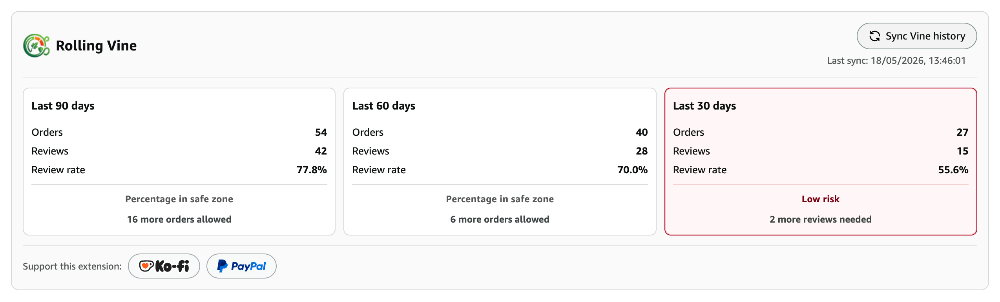

<p align="center">
	
</p>

Rolling Vine is a cross-browser WebExtension (Chrome, Firefox, Edge) for Amazon Vine users.
It adds rolling periods statistics to the Vine Account page and highlights risk windows where review completion rate is below 60%.

[](https://ko-fi.com/fedefluork)
[](https://paypal.me/FedeFluork)

## Installation

- **Chrome: https://chromewebstore.google.com/detail/rolling-vine/hgiimajedoelhkpgfknfhipedhlaoebj**
- **Firefox: https://addons.mozilla.org/en-US/firefox/addon/rolling-vine/**
- **Edge: https://microsoftedge.microsoft.com/addons/detail/rolling-vine/gocnagihbolpjmbmfnepafelllpfdeok**

## What It Does

On the Vine Account page (`/vine/account`), the extension injects:

- 3 rolling periods cards: Last 90 days, Last 60 days, Last 30 days
- For each card:
	- Orders
	- Reviews
	- Review rate
	- Risk level label with severity by period (high risk at 90 days, moderate at 60, low at 30)
	- Actionable info: how many more orders are allowed or reviews are needed
- Sync controls:
	- `Sync Vine history` button
	- Live sync progress state (starting, orders, reviews)
	- `Last sync: <timestamp>` label
- Safe-stop feedback with localized reason when sync is interrupted (CAPTCHA, expired session, timeout, unexpected markup)
- A compact donation row with links to Ko-fi and PayPal
- All UI labels are localized (English, Italian, Spanish, German, French, Japanese)

From the extension toolbar popup, you get a compact risk overview of your selected rolling periods.
From the settings page, you can customize theme, card placement, visible periods, and language.

<p align="center">
	
</p>

## How Sync Works

Sync is user-triggered from your Vine Account page at `/vine/account`.

1. User clicks `Sync Vine history`.
2. The background service worker starts a fetch-based sync job (no automatic tab opening or tab navigation).
3. It requests paginated Vine pages in this strict order:
	 - Orders:
		 - `/vine/orders`
		 - `/vine/orders?page=2`
		 - `/vine/orders?page=3`
		 - ...
	 - Completed reviews:
		 - `/vine/vine-reviews?review-type=completed`
		 - `/vine/vine-reviews?page=2&review-type=completed`
		 - `/vine/vine-reviews?page=3&review-type=completed`
		 - ...
4. Each page fetch uses retry attempts, timeout guards, and pacing delays.
5. It counts only items in the last 90 days from sync start.
6. It stops scanning when one of these conditions is met:
	 - items older than 90 days are reached
	 - no next page is available
	 - for orders, the last known checkpoint timestamp is reached
7. It stores 90/60/30-day aggregates locally, updates sync metadata, caches order timestamps for incremental sync, and refreshes UI data used by both the account page and popup.

Sync uses a checkpoint cache: on subsequent runs it can skip already-scanned order pages, making repeat syncs faster.

## Safety and Failure Policy

The sync pipeline stops safely and immediately if it detects:

- CAPTCHA pages
- Login/session expiration
- Empty or unexpected markup (no parsable records)
- Request timeout or repeated fetch failures

When safe-stop happens, previous valid metrics remain visible and the UI shows a user-friendly, localized message describing the specific reason (e.g. CAPTCHA requested, session expired, page timeout).

The worker uses small bounded random delays between requests for load pacing and stability.

## Settings and Customization

The options page provides:

- Theme: Auto, Light, Dark
- Card placement on `/vine/account`: Above or Below official metrics
- Visible rolling periods: 90 days (always enabled), optional 60 days and 30 days
- UI language override: Auto, English, Italian, Spanish, German, French, Japanese
- Full reset action for extension settings and stored metrics

## Data Model and Risk Logic

For each period (`90`, `60`, `30`):

- `review_rate = (reviews / orders) * 100`
- If `review_rate < 60`, status is `At risk` with a period-specific severity label:
	- 90 days: high risk of Vine Jail
	- 60 days: moderate risk
	- 30 days: low risk
- If `review_rate >= 60`, status is safe (neutral label)
- If `orders == 0`, review rate is shown as `N/A`, status remains neutral

When at risk, each card also displays how many more reviews are needed to reach the 60% threshold. When safe, it shows how many more orders can be placed before hitting the limit.

## Browser Compatibility Choices

- Single codebase with Manifest V3
- Firefox compatibility via `browser_specific_settings.gecko` and `gecko_android` in manifest
- Firefox Android support (`strict_min_version: 142.0`)
- Cross-browser compatible `chrome.*` and `browser.*` extension APIs with dual-path storage helpers
- Browser-specific behavior is isolated in build output:
	- Chrome/Edge package strips Firefox-specific manifest metadata
	- Firefox package keeps Gecko metadata for AMO

Supported Amazon Vine domains (with automatic localization):

- `www.amazon.com`
- `www.amazon.co.uk`
- `www.amazon.de`
- `www.amazon.fr`
- `www.amazon.it`
- `www.amazon.es`
- `www.amazon.ca`
- `www.amazon.com.au`
- `www.amazon.co.jp`

## Local Privacy Model

- No external backend
- No third-party data processing
- All parsing and aggregation run locally in extension context
- Metrics and sync state are stored in `chrome.storage.local`

## Setup

Requirements:

- Node.js 20+

Install:

```bash
npm install
```

Run tests:

```bash
npm test
```

Build dist folders:

```bash
npm run build
```

Build ZIP artifacts:

```bash
npm run zip
```

Lint extension:

```bash
npm run lint
```

## Load Unpacked Extension

### Chrome

1. Open `chrome://extensions`
2. Enable Developer mode
3. Click `Load unpacked`
4. Select `dist/chrome` (or `src` for quick dev)

### Firefox

1. Open `about:debugging#/runtime/this-firefox`
2. Click `Load Temporary Add-on`
3. Select `dist/firefox/manifest.json` (or `src/manifest.json`)

### Edge

1. Open `edge://extensions`
2. Enable Developer mode
3. Click `Load unpacked`
4. Select `dist/chrome` (or `src` for quick dev)

## Assumptions and Limitations

- Amazon Vine DOM can change over time; selector fallback strategy is implemented but may require updates.
- The scraper assumes paginated lists are chronological.
- Completed review entries from `/vine/vine-reviews?review-type=completed` are treated as approved reviews for rolling calculations.
- Safe-stop is preferred over risky extrapolation if parser confidence is low.

## Disclaimer

This extension is an independent tool and is not affiliated with or endorsed by Amazon.
By using it, you acknowledge that you are solely responsible for your account activity and compliance with Amazon policies.
The author assumes no liability for account warnings, suspensions, bans, or any other actions/provisions applied to your account.

## License

See `LICENSE`.